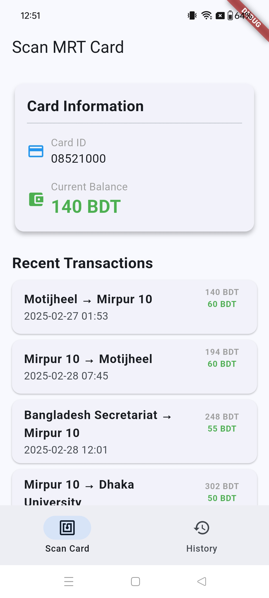

# MRT Reader

This project is a Flutter/Dart-based implementation inspired by the original work done in Kotlin and Compose by [Aniruddha Adhikary](https://github.com/aniruddha-adhikary/mrt-buddy). The original code and idea have been adapted to Flutter for my own use and exploration.

## License

This project is licensed under the terms of the GNU General Public License v3.0 (GPL-3.0). See the [LICENSE](LICENSE) file for details.

## Acknowledgements

The core idea and logic for this project were inspired by [MRT Buddy](https://github.com/aniruddha-adhikary/mrt-buddy), created by Aniruddha Adhikary. Thanks to the team for the original work!

