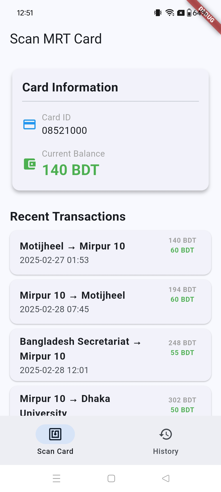

# Dhaka MRT Card Reader Example

A simple Flutter application that demonstrates how to use the MRT Card Reader package to read transaction data from Dhaka MRT Line 6 metro rail cards.

## Getting Started

This example shows how to:

1. Check for NFC availability
2. Start an NFC scanning session
3. Process and display transaction data from a Dhaka MRT metro rail card
4. Show card balance and transaction history for Dhaka Line 6 stations

## Running the Example

Ensure you have Flutter installed and set up. Then run:

```bash
flutter pub get
flutter run
```

## App Structure

- **main.dart**: A complete example app with a user interface for scanning Dhaka MRT cards and displaying results
- **pubspec.yaml**: Dependencies configuration including the mrt_card_reader package

## Features Demonstrated

- Checking NFC availability
- Reading Dhaka MRT card data
- Displaying transactions with color-coded amounts
- Showing card balance
- Viewing journey history between Line 6 stations

## Screenshot

When running the app, you should see something like:

 